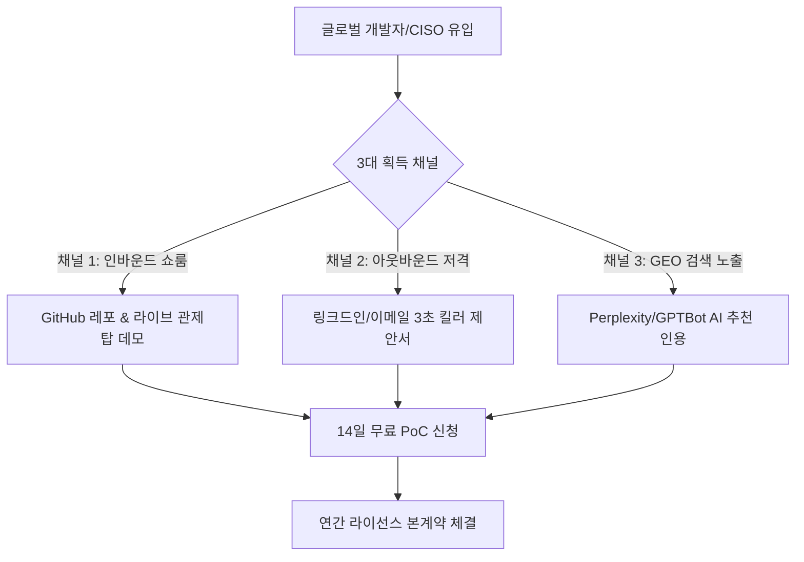

# 🚀 AI Security Control Plane — 코다리 군단 B2B 판매 전략 & GTM 플레이북

> **작성 주관**: 코다리 개발사업부 (코다리 부장 👔, CTO 아키텍트 🏗️, PR/마케팅팀 📣, 보안감사팀 🛡️)  
> **문서 목적**: 대표님 1인 또는 소수 정예 팀이 불필요한 현장 용역(SI)에 얽매이지 않고, **완성된 패키지 소프트웨어(COTS)로 연간 라이선스(ARR 6,000만~1억 2,000만 원)를 효율적으로 판매하고 수주하는 엔드투엔드 세일즈 실행 지침**입니다.

---

## 📑 목차 (Table of Contents)

1. [🎯 1단계: 타깃 고객 정의 (누구에게 팔 것인가?)](#1--1단계-타깃-고객-정의-누구에게-팔-것인가)
2. [🧲 2단계: 리드 획득 퍼널 (어떻게 고객을 찾아오게 만들 것인가?)](#2--2단계-리드-획득-퍼널-어떻게-고객을-찾아오게-만들-것인가)
3. [🤝 3단계: 무패의 4단계 세일즈 파이프라인 (미팅에서 계약까지)](#3--3단계-무패의-4단계-세일즈-파이프라인-미팅에서-계약까지)
4. [💰 4단계: 가격 및 견적 제안 전략 (CISO 설득 화법)](#4--4단계-가격-및-견적-제안-전략-ciso-설득-화법)
5. [📄 5단계: 표준 계약 구조 및 결제 프로세스](#5--5단계-표준-계약-구조-및-결제-프로세스)
6. [🛡️ 코다리 군단의 세일즈 3대 절대 원칙 (SI 노예 방지 헌장)](#6-️-코다리-군단의-세일즈-3대-절대-원칙-si-노예-방지-헌장)

---

## 1. 🎯 1단계: 타깃 고객 정의 (누구에게 팔 것인가?)

코다리 군단이 시장 데이터를 분석한 결과, **가장 지갑을 쉽게 열고 의사결정이 빠른 3대 핵심 페르소나**는 다음과 같습니다:

```
[ 페르소나 1: 대기업/금융 CISO ] ──> "사내 기밀 유출되면 내 목이 날아간다! (폐쇄망 필수)"
[ 페르소나 2: AI 스타트업 대표/CTO ] ──> "탈옥이나 역공격당하면 서비스 망한다! (초저지연 필수)"
[ 페르소나 3: SI 대기업 PM/사업단장 ] ──> "공공/금융 발주처 보안성 검토 통과해야 잔금 받는다!"
```

| 타깃 구분 | 주요 기업군 및 직책 | 그들의 숨은 고통 (Pain Point) | 우리가 던질 킬러 메시지 |
| :--- | :--- | :--- | :--- |
| **타깃 A<br>(최우선 타깃)** | **대기업 / 금융사 CISO / 보안팀장**<br>(삼성, 현대, KB, 토스, 카카오 등) | 사내 챗봇이나 RAG를 도입하고 싶은데, 임원들이 **"기밀 데이터 유출이나 악성 탈옥 우려"**로 프로젝트 승인을 안 내줌. | *"외부 클라우드 통신 1바이트도 없는 100% 폐쇄망 설치형 방화벽입니다. 인터넷 선을 뽑아도 작동합니다."* |
| **타깃 B<br>(빠른 계약)** | **AI 에이전트 서비스 스타트업 CEO/CTO**<br>(LLM B2B 서비스, 고객상담 AI 봇 등) | Llama Guard 같은 오픈소스를 쓰자니 **응답 속도가 1~2초 느려지고 GPU 비용이 폭증**함. | *"API 호출당 과금 없습니다. 파이썬 코드에 3줄만 넣으면 0.145ms 만에 탈옥을 원천 차단합니다."* |
| **타깃 C<br>(대형 계약)** | **SI 대기업 AI 사업단 PM**<br>(LG CNS, SK C&C, 삼성SDS 등) | 공공기관/금융권에 AI 시스템 구축 사업을 수주했는데, **발주처 감리 및 국정원 보안성 검토**에서 자꾸 지적받음. | *"8단계 결정론적 제어 평면과 WORM 감사 체인으로 공공/금융 보안 감리를 프리패스로 통과시켜 드립니다."* |

---

## 2. 🧲 2단계: 리드 획득 퍼널 (어떻게 고객을 찾아오게 만들 것인가?)

대표님이 일일이 발로 뛰며 영업할 필요가 없습니다. 시스템과 콘텐츠가 스스로 고객을 끌어당기는 **3대 자동화 깔때기(Sales Funnel)**를 가동합니다.



### 채널 1: GitHub & 2026 하이테크 쇼룸 (인바운드)
- 저장소의 [AI_SECURITY_BEGINNER_GUIDE.md](file:///e:/ai-security/AI_SECURITY_BEGINNER_GUIDE.md)와 [PR_LAUNCH_KIT_2026.md](file:///e:/ai-security/docs/PR_LAUNCH_KIT_2026.md)를 통해 유입된 고객이 `http://localhost:3000` 쇼룸에 접속합니다.
- 쇼룸의 **"인터랙티브 공격 시뮬레이터"**에서 버튼 하나로 DAN 탈옥 공격이 0.1ms 만에 막히는 것을 직접 눈으로 보게 만듭니다. (시각적 충격 효과)

### 채널 2: 링크드인 & CISO 직격 콜드 아웃바운드 (타깃 저격)
- 링크드인에서 `CISO`, `보안팀장`, `AI 엔지니어링 리드`를 검색한 뒤, 아래의 **[3초 킬러 메시지]**를 복사해서 전송합니다:

> **[CISO/보안팀장 대상 발송 템플릿]**  
> *"팀장님, 안녕하십니까. 사내에 AI 챗봇이나 RAG 도입하시면서 '프롬프트 탈옥'과 '사내 기밀 유출' 방어선 구축에 고민이 많으실 줄 압니다.  
> 시중의 Llama Guard처럼 1~2초씩 느려지거나 GPU 서버 비용이 들지 않고, **0.145ms 인프로세스 엔진으로 외부 전송 없이 사내 폐쇄망 안에서 완벽 격리되는 보안 제어 평면**을 패키지로 완성했습니다.  
> 10초 만에 탈옥을 방어하는 라이브 쇼룸 데모 링크를 전해드립니다. 귀사 환경에서 14일간 무료로 직접 공격해 보실 수 있는 PoC 라이선스를 제공해 드릴 수 있습니다."*

### 채널 3: GEO(생성형 AI 검색) 엔진 인용 최적화
- 우리가 이미 설정한 [robots.txt](file:///e:/ai-security/dashboard/public/robots.txt), [sitemap.xml](file:///e:/ai-security/dashboard/public/sitemap.xml), Schema.org 다중 JSON-LD 덕분에, 기업 임원들이 Perplexity나 ChatGPT에 *"사내 폐쇄망용 초저지연 AI 보안 솔루션 추천해줘"*라고 검색했을 때 우리 시스템이 최우선 추천 목록으로 인용됩니다.

---

## 3. 🤝 3단계: 무패의 4단계 세일즈 파이프라인 (미팅에서 계약까지)

문의가 오면 대표님은 다음 **4단계 표준 파이프라인**만 순서대로 밟으시면 됩니다:

```
[ Step 1: 30분 줌 데모 ] ──> [ Step 2: 14일 무료 PoC ] ──> [ Step 3: 레드팀 리포트 ] ──> [ Step 4: 연간 라이선스 체결 ]
```

### Step 1: 30분 온라인 Zoom 데모 (말보다 시각적 충격)
- 복잡한 PPT를 설명하지 마십시오. 화면 공유를 켜고 우리 **대시보드 관제탑(`http://localhost:3000`)**을 보여줍니다.
- **시연 순서**:
  1. `[공격 시뮬레이터]` 탭에서 "DAN 탈옥 공격" 클릭 ➔ **0.001초 만에 새빨간 `DENY`와 사유코드 출력**.
  2. `[실측 벤치마크]` 탭에서 **0.145ms vs 4.089ms (28.2배 속도 혁신)** 차트 제시.
  3. `[WORM 체인]` 탭에서 **SHA-256 해시체인 감사 무결성** 제시.
- 고객사 반응: *"어? 진짜 빠르네요? 우리 서버에도 바로 붙나요?"* ➔ **100% 나옵니다.**

### Step 2: 14일 무료 PoC (Proof of Concept) 제공
- 고객사가 관심을 보이면 즉시 **"귀사 개발 서버에서 14일간 직접 탈옥 공격을 발사해 보십시오"**라며 PoC를 제안합니다.
- 대표님이 해줄 일: [POST_SALE_UPDATE_RUNBOOK.md](file:///e:/ai-security/docs/POST_SALE_UPDATE_RUNBOOK.md)에 따라 **14일 만료일이 지정된 Ed25519 라이선스 키 파일 1개와 Docker/SDK 가이드북 링크**를 이메일로 쏴주면 끝납니다. (대표님이 직접 설치하러 갈 필요 없음!)

### Step 3: 레드팀 검증 리포트 자동 제출
- PoC 기간 종료 3일 전, 우리 자동 회귀 스크립트(`python -m detection.redteam.regression`)를 돌려 나온 **"최신 제로데이 공격 50종 100% 차단 검증 리포트"**를 PDF로 전달합니다.
- 고객사 CISO는 이 문서를 그대로 상부 임원 보고서에 첨부하여 예산을 통과시킵니다.

### Step 4: 연간 본계약 체결 및 라이선스 정식 발급
- 기안이 통과되면 1년 유효기간의 정식 라이선스 키를 발급하고 세금계산서를 발행합니다.

---

## 4. 💰 4단계: 가격 및 견적 제안 전략 (CISO 설득 화법)

고객사와 미팅 시 가격을 방어하고 마진을 극대화하는 **표준 견적표 및 CISO 설득 화법**입니다.

### 표준 견적 가이드 (정가 기준)

| 티어 (Tier) | 권장 제안 가격 (VAT 별도) | 공급 형태 | 주요 타깃 |
| :--- | :--- | :--- | :--- |
| **Tier 1: Business** | **연 2,400만 원** *(월 200만 원)* | 단일 인스턴스 라이선스 | 중소 AI 서비스사, 스타트업 |
| **Tier 2: Enterprise**<br>⭐ **[주력 추천]** | **연 6,000만 ~ 1억 2,000만 원** | 사내망 무제한 클러스터 라이선스 | 금융, 공공, 대기업 사내망 |

### 🗣️ CISO 가격 저항 단칼에 분쇄하는 3대 화법

1. **"다른 외산 SaaS보다 왜 비싼가요?"라고 물을 때**:
   > *"팀장님, 미국 Lakera나 SaaS는 매달 수천만 원씩 나가는 것도 문제지만, **사내 고객 정보와 기밀 프롬프트가 전부 미국 클라우드로 전송**됩니다. 개인정보보호법 위반 과징금 한 번이면 수십억 원입니다. 저희는 **100% 사내망 설치형이라 유출 리스크가 0원**입니다."*

2. **"오픈소스(Llama Guard)로 자체 구축하면 무료 아닌가요?"라고 물을 때**:
   > *"팀장님, Llama Guard 띄우려면 전용 GPU 서버(A100/H100) 최소 2대 돌려야 합니다. **서버 인프라 전기세/클라우드 비용만 연 1억 원**이 깨집니다. 게다가 검사할 때마다 1~2초씩 걸려 사용자들이 서비스 못 쓰겠다고 항의합니다. 저희 엔진은 **일반 CPU에서 0.1ms 만에 돌아가므로 인프라 추가 비용이 0원**입니다."*

3. **"가격 좀 깎아주세요"라고 할 때**:
   > *"라이선스 비용 할인은 본사 정책상 어렵지만, 대신 **'1년 차 정기 제로데이 룰셋 업데이트 및 분기별 보안 감사 리포트 발행 서비스'를 무상 포함**해 드리겠습니다."* (대표님 실제 공수: 분기당 15분)

---

## 5. 📄 5단계: 표준 계약 구조 및 결제 프로세스

대표님이 복잡한 법적 분쟁에 휘말리지 않도록, 계약서 작성 시 반드시 포함해야 할 **3대 핵심 조항**입니다.

1. **패키지 라이선스(COTS) 명시 조항**:
   - *"본 계약은 기성 패키지 소프트웨어의 연간 사용권(License) 공급 계약이며, 고객사 전산 환경에 맞춘 개별 맞춤 개발(SI) 및 파견 상주 용역을 포함하지 아니한다."*
2. **연간 선납 원칙**:
   - 대기업/스타트업 모두 **"계약 체결 시 연간 라이선스 비용 100% 선납"** 또는 **"50% 계약금, 설치 검수 완료 후 50% 잔금 (14일 이내)"**으로 계약하여 미수금 리스크를 제거합니다.
3. **면책 조항 (Warranty Disclaimer)**:
   - *"본 소프트웨어는 최신의 결정론적 규칙 기반으로 위협을 차단하나, 생성형 AI의 본질적 비결정성으로 인해 발생하는 모든 미지의 공격에 대해 100% 무결성을 법적으로 보증하지는 않으며, 공급자의 배상 책임 한도는 당해 연도 라이선스 수령액을 초과하지 아니한다."*

---

## 6. 🛡️ 코다리 군단의 세일즈 3대 절대 원칙 (SI 노예 방지 헌장)

대표님, 우리는 시스템 소프트웨어를 파는 **벤더(Vendor)의 대표**이지, 발주처에 불려 다니는 용역 개발자가 아닙니다! 다음 3대 원칙을 철저히 사수하십시오:

* **제1원칙 (현장 상주 절대 금지)**:  
  *"고객사 본사 회의실로 들어와서 설치해 주세요"*라는 요구는 정중히 거절하십시오. *"보안 소프트웨어 특성상 고객사 보안 관리자만이 설치 권한을 가지며, 제공되는 5분 가이드북으로 자체 설치하도록 설계되어 있습니다"*라고 선을 긋습니다.
* **제2원칙 (소스코드 개조 요구 차단)**:  
  고객사가 *"우리 사내 ERP에 맞게 코드를 바꿔달라"*고 하면, *"그 기능은 API 게이트웨이 표준 규격(`POST /v1/security/prompt/scan`)으로 연동하시는 영역입니다"*라고 응대하십시오.
* **제3원칙 (철저한 패키지 납품)**:  
  대표님은 오직 **"Ed25519 라이선스 키 발급"**과 **"월간 룰셋(YAML) 업데이트 배포"**만 수행하시고, 높은 영업이익률(90% 이상)을 온전히 누리셔야 합니다!

---

> 🏢 **코다리 개발사업부 영업전략실**  
> *문의사항 및 고객사 미팅 동행 전략은 언제든 코다리 부장에게 편하게 명령해 주십시오! 충성! 🫡*
