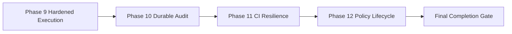

# Architecture Completion Roadmap

목적: 공식 아키텍처 Phase 0–8 이후 문서에 남아 있는 배포·운영 경계를 완성해, “100% 완료”를 재현 가능한 증거로 판정한다.

공식 Phase 0–8을 변경하거나 새 제품 기능을 추가하지 않는다. 아래 계획은 현재 코드와 기존 설계 문서가 이미 요구한 경계를 구현·검증하기 위한 후속 작업이다.

## 완료 정의

100%는 다음 조건을 모두 만족하는 상태다.

1. 공식 Phase 0–8의 기능·보안 테스트가 계속 통과한다.
2. 프로세스가 요구된 OS 격리 없이 실행되지 않는다.
3. 네트워크 목적지가 DNS 재해석 없이 승인된 주소에 바인딩된다.
4. production startup이 검증된 정책·승인·감사 저장소 없이는 시작되지 않는다.
5. 감사 로그의 무결성, 다중 프로세스 동시성, 보존 정책이 실제 환경에서 검증된다.
6. fault matrix와 성능 이력이 CI에서 반복 실행되고 raw secret/payload를 노출하지 않는다.
7. 모든 완료 항목에 테스트 결과, 환경, 버전, 로그 fingerprint가 남는다.

## Phase 9 — Hardened Execution Isolation

Status: **COMPLETE ON WINDOWS 11** (2026-09-10). Enforcement evidence is in
`tests/unit/test_sandbox_limits.py` and
`tests/security/test_process_firewall.py`; unsupported hosts fail closed.

### 범위

- 프로세스 생성 전 OS isolation이 준비되는 backend 계약
- Windows Job Object의 pre-launch/suspended-process 적용
- CPU·memory ceiling의 실제 Windows 통합 테스트
- firewall-backed network isolation
- read-only workspace
- restricted token 또는 AppContainer 적용
- isolation failure, capability replay, timeout, output limit의 fail-closed 검증

### 구현 순서

1. `ProcessIsolationBackend`를 pre-launch 보장 계약으로 확장한다.
2. pre-launch 보장이 불가능한 backend는 child를 만들지 않고 거부한다.
3. Windows runner에서 suspended process → isolation binding → resume 순서를 검증한다.
4. 네트워크 차단을 실제 host adapter 또는 명시적 firewall backend로 연결한다.
5. workspace와 token 경계를 적용하고 child 및 descendant까지 포함해 검증한다.

### 완료 기준

- 격리 적용 전 child 실행을 관찰할 수 없다.
- CPU, memory, network, workspace, token 통제가 실제 테스트에서 enforce된다.
- 하나라도 host capability가 없으면 startup 또는 execution이 DENY된다.
- Windows CI에서 관련 security test가 통과한다.

## Phase 10 — Durable Audit Deployment Hardening

상태: **완료** (2026-09-10). Cloudflare R2 실환경에서 쓰기, 멱등 재시도,
`audit/` Bucket Lock 삭제 거부를 검증했다.

### 범위

- JSONL hash chain의 다중 프로세스 동시 append 안전성
- OS ACL 및 audit file ownership hardening
- 원격 WORM/immutable 저장소 adapter
- local store와 remote store 간 failure 시 fail-closed 정책
- 복구·검증·tamper detection runbook

### 완료 기준

- 동시 writer 테스트에서 hash chain이 끊기지 않는다.
- 권한 없는 writer/reader가 거부된다.
- 원격 저장소 장애 시 보안 결정이 감사 누락 상태로 ALLOW되지 않는다.
- restore와 chain verification 결과가 재현 가능하다.

## Phase 11 — CI Resilience and Evidence

Status: **COMPLETE** (2026-09-10). GitHub Actions run `34475525577` passed all
19 jobs; local verification recorded `306 passed, 3 skipped`, package build
success, and a clean dependency audit.

### 범위

- 전체 fault matrix CI job
- Phase별 security regression job
- p95/max latency benchmark history
- 결과에 payload, prompt, secret 원문이 포함되지 않는 artifact 정책

### 완료 기준

- CI에서 fault matrix가 반복 실행된다.
- 실패한 stage와 reason code를 식별할 수 있다.
- raw input/output/secret이 artifact와 로그에 없다.
- latency regression threshold 위반 시 CI가 실패한다.
- 미지원 네이티브 격리 호스트는 테스트를 건너뛰지 않고 명시적으로
  fail-closed DENY를 반환한다.

## Phase 12 — Production Policy Lifecycle

Status: **LOCAL IMPLEMENTATION VERIFIED; GITHUB CI EVIDENCE PENDING**

### 범위

- production 환경의 verified policy 강제
- 서명 키·signer identity 관리와 rotation
- approval binding, monotonic version, rollback denial
- policy store 장애·서명 오류·승인 불일치의 startup fail-closed
- policy activation과 audit chain의 운영 연계

### 완료 기준

- production은 검증된 정책 없이는 시작되지 않는다.
- 정책 변경·승인·활성화·거부가 fingerprint 기반으로 감사된다.
- private key와 raw policy secret이 로그에 없다.
- rollback 및 signer mismatch 테스트가 통과한다.

### 현재 증거 (2026-09-11)

- canonical full-bundle signature와 fingerprint 재검증이 rule tampering을
  차단한다.
- authenticated approval이 policy id, version, fingerprint, signer에
  바인딩된다.
- 영속 store history가 restart 후 rollback과 policy-id switch를 거부한다.
- verified-only registry가 unsigned publication을 거부한다.
- 활성 정책 findings가 FastAPI·CLI 및 각 보안 경계의 Risk/Policy 흐름에
  합류한다.
- signer key-map overlap과 revocation cutover 회귀가 통과한다.
- activation 성공·거부가 raw policy/key 없이 fingerprint로 감사된다.
- 로컬 Python 3.12 전체 결과는 `320 passed, 3 skipped`; build, dependency
  audit, fault matrix가 통과했다.
- 최종 COMPLETE 판정은 GitHub Phase 0–12 CI 증거 후 갱신한다.

## Final Completion Gate

| Gate | Required evidence |
|---|---|
| Architecture | Phase 0–8과 Phase 9–12 traceability matrix |
| Security | Critical/High regression suite 및 fail-closed 결과 |
| Isolation | Windows/Linux host capability 및 실제 enforcement 결과 |
| Audit | tamper, concurrency, ACL, remote durability 결과 |
| CI | fault matrix, benchmark history, secret-safe artifacts |
| Policy | production signed activation 및 rollback/rotation 결과 |
| Release | package build, container validation, deployment checklist |

100% 판정 전까지의 표현은 “Phase 0–8 완료, Phase 9–12 잔여 경계 진행 중”으로 제한한다.
